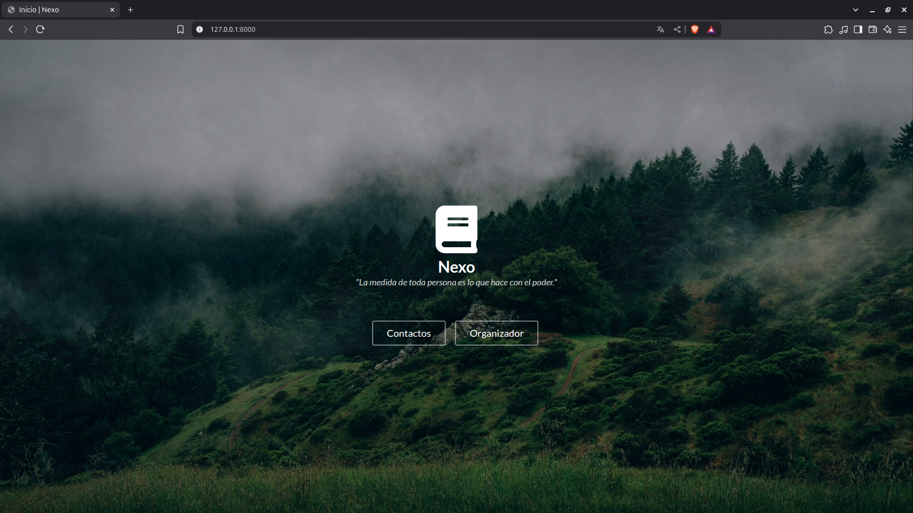

# Nexo, a personal organizer

---

## An small but functional personal organizer written in Python by using Django and Semantic UI

"Nexo" is an small web personal organizer with two principal functionalities: a contact list and a task manager. This project was built with Django and Semantic UI. The main purpose of this project is showing my developer abilities.

---

## Installation instructions